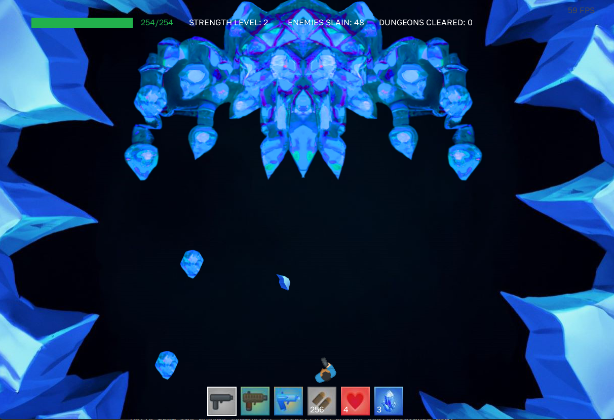

# Ruin Raider

In this dungeon-themed top-down shooter game, the player is tasked with making their way through the dungeon ruins with a pistol to fight through enemies and collect the Arctium crystals at the end of each level. The player starts the game with 100 health and an inventory of 6 slots. If the player loses all their health, they die and restart at the beginning of the current level with their inventory retained.

## Project Setup

> Uses Python *3.10.10*

1. Install [`pipenv`](https://pipenv.pypa.io/en/latest/#install-pipenv-today) using `pip install --user pipenv`
    - If you are using Windows, you may need to add `C:\Users\{username}\AppData\Roaming\Python\Python39\Scripts` to your PATH environment variable
2. Run `pipenv install` in project directory
3. Use `pipenv run python .\game.py` to run the game

> If you are using VS Code, install `Python Enviroment Manager`

## How to Play

## Screenshots

> Playable Area

> Player Select

> Playable Area

> Boss Level

